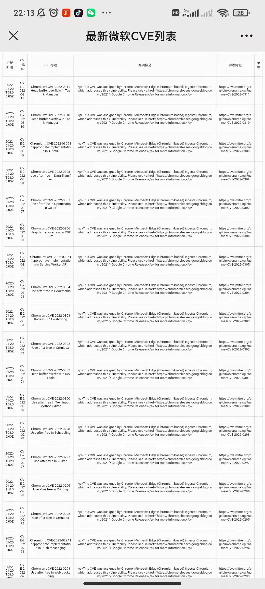

# 漏洞监控平台——Monitor

## 免责声明

本程序仅用于内部测试与学习交流，请勿用于其他用途。使用者请务必遵守当地法律！！


## 写在前面的话

对于网络安全从业者来说，实时掌握漏洞动态是至关重要的，所以萌生了开发一个监控平台的想法，把最新漏洞资讯集成然后进行推送。这里推送选的是企业微信，留下了邮件推送的接口，默认是关闭的，想开启的小伙伴自行开启。数据库选用的是sqlite。目前实现了监控GitHub、微软、CNNVD。（不要问我为啥不监控CNVD，我是不会告诉你我干不过它的反爬【狗头保命】）。

项目已开源，欢迎师傅们送Star⭐⭐⭐

## 项目介绍

### 更新GitHub中issues监控和安全文章监控（2023.1.15）

这几天将之前写的漏洞情报监控更新了一下，增加了一些新功能，包括增加GitHub知名项目issues监控、安全社区文章监控等，并添加了相关配置文件，这次所有配置都只需要在修改配置文件即可。

#### 添加配置文件

这次所有的配置只需要在配置文件中进行修改。包括脚本循环间隔时间也是在这里设置。如下图：


#### GitHub知名项目issues监控

目前实现实时监控github中相关issues。并且实现自定义配置，想监控哪个知名组件，只需要在配置文件中填写相对应的github_owner和gitHub_project。**可以同时监控多个项目，在配置文件中使用逗号隔开**。我这里填写了三个项目进行演示，如下图所示：

**注意：github_owner和gitHub_project一定要一一对应，不然监控不到！**实现的效果如下图：


#### 安全社区文章监控

目前实现了监控先知社区、跳跳糖社区、奇安信攻防社区三个社区的文章监控。启动脚本后，实现的效果如下图


后续有时间的话应该会优化一下安全社区推送的相关代码逻辑，现在的代码复用太高了。有机会也会优化一下邮件推送。

### 更新简化配置（2022.1.27）

**添加requirements.txt配置文件**

~~**简化企业微信配置流程**~~

~~现在企业微信配置**只需要修改monitor.py文件中的24-38行**就可以了。如下图：~~

### 项目目录结构

```
│  cve_db.db
│  monitor.py
│  style.css
│  config.ini
├─Functions
│  ├─Commons
│  │      excel.py
│  │      excel_html.py
│  │      github.py
│  │      mail.py
│  │      style.css
│  │      translate.py
│  │      wechat_api.py
│  │      __init__.py
│  │
│  ├─RequestInfo
│  │      cnnvd_monitor.py
│  │      github_monitor.py
│  │      MS_monitor.py
|  |      SEC_node_monitor.py
│  │      __init__.py
│  │
│  └─Sql
│          installDb.py
│          sql_helper.py
│
└─log
```


### 文件说明

**monitor.py**文件是主文件，部署完成后直接运行就此文件可以。

**Commons**目录下的文件为主要功能文件。

**RequestInfo**目录下为监控目标的一些文件。

**Sql**目录下为数据库相关文件，installDb.py是用来生成数据库和日志文件的。

**log**目录为存放日志文件目录。

### 功能介绍

同时监控CNNVD、Github、微软官方的漏洞消息。

#### CNNVD

- [x] 每天推送企业微信卡片消息
- [x] Web端漏洞信息表格展示
- [x] 每周五统计漏洞数量（高危、中危、低危）
- [x] 高危漏洞信息醒目标注

#### 微软官方漏洞消息

- [x] 每天推送企业微信卡片消息
- [x] Web端漏洞信息表格展示

#### Github

- [x] 每天推送企业微信卡片消息
- [x] 点击卡片消息自动跳转对应Github链接

#### 展示效果

效果如下图


**当点击CNNVD的消息卡片时，会跳转到相对应的Web端以表格形式展示**，如下图：


**点击微软漏洞消息的漏洞卡片时，也会跳转到相对应的Web端表格展示**，如下图：



~~**点击Github的漏洞消息通知时，跳转到相对于的Github地址**，如下图：~~

## 项目部署

### 前期准备

- 开发语言：python3
- 一台服务器(脚本跑在服务器上)
- 一个域名(可选)

首先安装依赖，如下：

```
pip install -r requirements.txt
```

然后进行数据库初始化，初始化时生成log文件夹用来存放生成的日志文件。命令如下：

```python
python3 installDb.py
```

### 环境搭建

因为要做Web端表格展示，所以这里**使用Nginx做了目录浏览**。服务器系统使用的是CentOS7，过程如下。

首先使用yum源下载nginx，命令如下：

```
yum install -y nginx
```

装好后，查看版本，检查是否安装成功，如下图：


然后找到nginx的配置文件，具体位置为：

```
cd /etc/nginx/
```

找到nginx.conf文件，对其中的server板块进行修改就可以了，**主要是添加了末尾三行**。

```
server {
    listen       80;
    listen       [::]:80;
    server_name  _;
   # root         /usr/share/nginx/html;
    charset utf-8;
    # Load configuration files for the default server block.
    include /etc/nginx/default.d/*.conf;
    location / {
            root /usr/share/nginx/html/download; 
    autoindex on; #开启索引功能
    autoindex_exact_size off; #关闭计算文件确切大小(bytes)
    autoindex_localtime on; #显示本机时间
	}
}
```

**注意生成文件位置**，我这里是`/usr/share/nginx/html/download` ，看个人爱好。(现在只需要在配置文件config.ini中配置即可)

~~**如果修改，请修改monitor.py的24行和excel_html.py的11行。**~~

~~### 配置企业微信推送~~
~~这个需要先到企业微信创建一个企业，并自建一个应用，**获取到自定义应用的 Secret和注册的企业 corpid**，就可以了。修改位置在moniter.py文件的14行至17行，如下图：~~

#### ~~自定义推送内容修改事项~~
~~根据自己实际情况修改 RequestInfo文件夹下的文件。**如果是自己使用，请注释掉toparty，取消touser的注释~~

**应用ID**和**部门ID**在企业微信后台如下位置


启动监控脚本，命令如下：

```
python3 monitor.py
```

大功告成！！！


